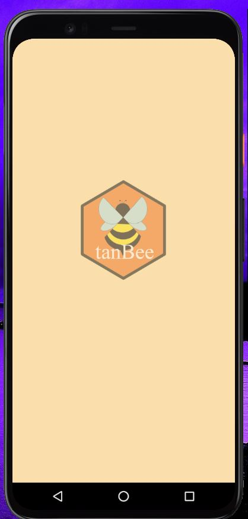
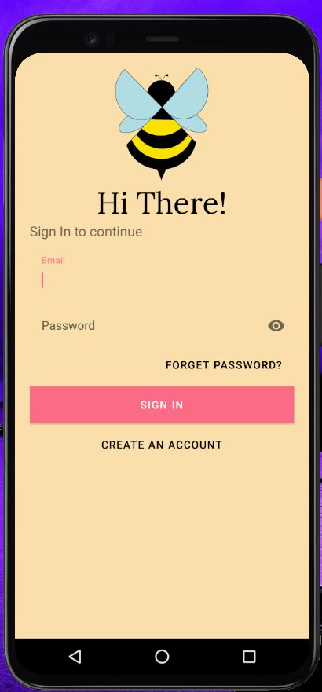
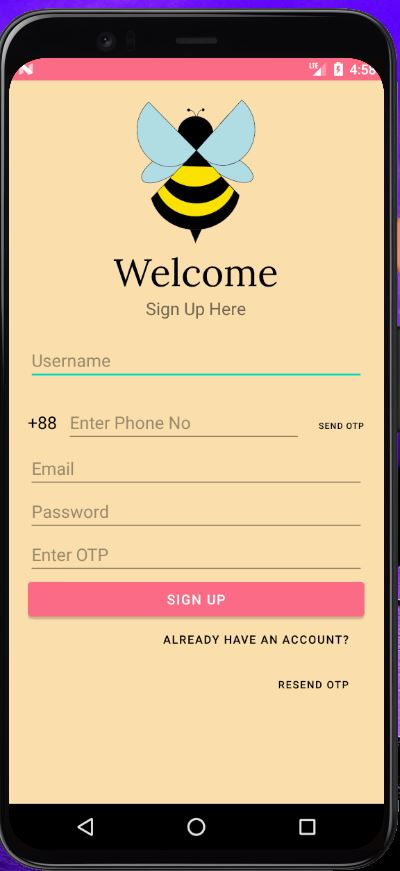
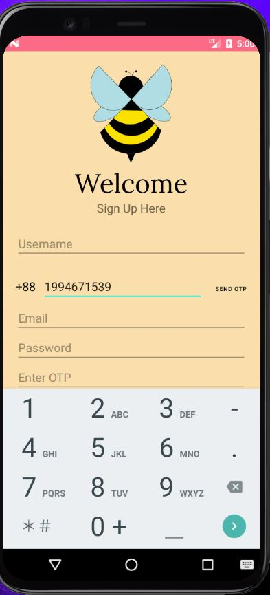
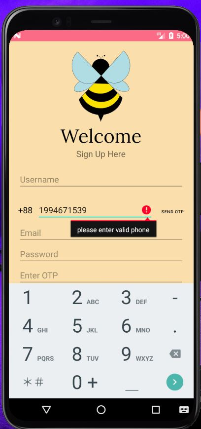
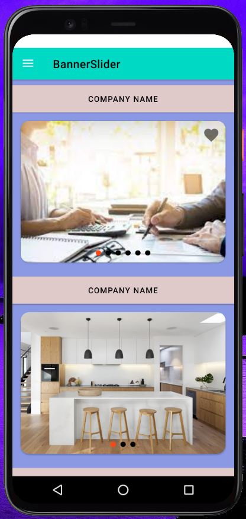
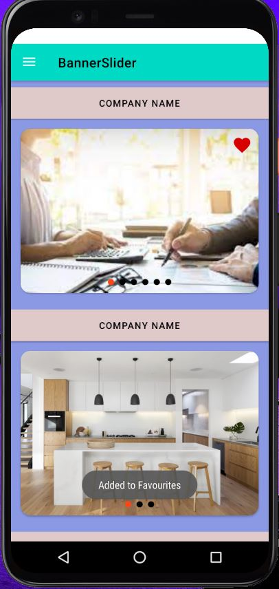

# Self-Practicing-Android-Project

&nbsp;

&nbsp;

<strong>Name</strong><strong>:</strong> Kazi Ruhol Kabir Moahhed 

<strong>ID</strong><strong>:&nbsp; </strong>1721103642

<strong>Email</strong><strong>:</strong> <a href="mailto:kazi.moahhed@northsouth.edu">kazi.moahhed@northsouth.edu</a>

<strong>Git Repository</strong><strong>: </strong><a href="https://github.com/KaziRuholKabir/Self-Practicing-Android-Project">https://github.com/KaziRuholKabir/Self-Practicing-Android-Project/</a>

<strong>Date Prepared</strong><strong>: </strong>15/01/2022

<strong>&nbsp;</strong>

<strong>&nbsp;</strong>

<h2> SELF LEARNING </h2> 

 
<h2 id="#introduction">1. Introduction</h2>

I have built an app specially for faculty members. Where a faculty can manage his students data. A faculty is a very busy person so I think this app will help them to manage their students. They can keep track of their student’s data. They will be able to update data on regular basis. There is a database where I created a lot of data table (Faculty table, student table, etc.). A data table to keep Faculty’s username and password to login. And a data table to keep students data like F.name, L.name, Id, PhoneNo, etc. And a data table to keep data on regular basis like exam’s marks. At the start of a semester a faculty member will be given a section on his particular subject. In a section there will be 40 students. And throughout the semester the faculty have to upload regular data like Quiz-I marks, Quiz-II marks, MID marks, Final Marks. At the end of the table there will be a column for total marks and Final Grade. Grade will be on a university’s grading policy (ex- North South University).

<h2 id="features">2. Software Specification</h2>

This Work has the following features -

<strong>&nbsp;</strong>

<strong>SPLASH SCREEN:</strong>

To get to the login activity of this android application user have to go through a 3 sec of SPLASH SCREEN. Which will try to impress user.

  
    
 

    
   Figure 1.0
 

 
<strong>Login to a specific platform:</strong>

 
After registering successfully then user have to go through login phase. The main feature will be accessed after successfully logged in.

  
    
 

    
   Figure 2.0
 

<strong>User Registration:</strong>

To Access main activity of this android application user must need to register. Users must have to provide their information. Form Validation also done here, So if user gives any wrong info then they will be toasted.

  
    
 

    
 
 
   Figure 3.0
 

 
<strong>OTP:</strong>

 
After Entering Phone no a cerification code will be sent to that number and user have to enter to verify there number. This service is provided by the firebase

  
    
 

    
   Figure 4.0
 

  
<strong>HOME Activity:</strong>

 
Here I have made 5 separate catagory of banner slider. Where different banners will be shown of different categories. It is connected with firebase and automatically updates itself while firebase storage changes.

  
    
 

    
   Figure 5.0
 

  
<strong>Favourites:</strong>

 
This is a Cute feature. By clicking it the item will be added to a favourite list.

  
    
 

 
    
   Figure 6.0
 

  
<strong>Navigation Drawer:</strong>

 
This is a complete drawer. This drawer is not the built in drawer of Android Studio. It is codded customely. and this drawer is accessible from every activity

  
    
 

    
   Figure 7.0
 

  
<strong>Notification:</strong>

 
This is an intersting feature of firebase which I discovered first time. This feature send notification to the users who has downloaded my app.

  
    
 

    
   Figure 8.0
 

 

 <h2 id="#technology">3. Technology</h2>

&nbsp;

<strong>Proposed Technology Stack:</strong>

I proposed to Build mark sheet app by using Android studio 4.2.2 . Which is the latest version of android studio. Android studio is one of the most popular and a complete software to build android applications. For my Front end I decided to use xml to design my front end. For backend I decided to use java programming language. And for database I decided to use Firebase.

&nbsp;

<h2>5. Conclusion</h2>

This work is basically made for my self learning purpose. Where I will be able to show my skills and dedication to the Employers.

